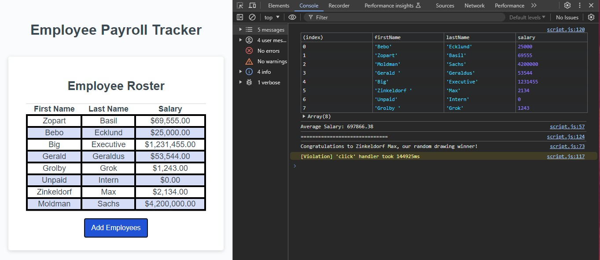

# Module03-Challenge
Employee Information Tracker

# Employee Payroll Tracker

## Description 

The Employee Payroll Tracker is a tool for payroll managers to track employee data and budget efficiently. This application allows you to add employees, view their data, see the average salary, and randomly select an employee for recognition. It ensures accurate data collection and provides valuable insights.

## Table of Contents

* [Installation](#installation)
* [Usage](#usage)
* [Credits](#credits)
* [License](#license)
* [Features](#features)
* [Contributing](#contributing)
* [Tests](#tests)

## Installation

To install and run this project, follow these steps:

1. Clone the repository:
   ```bash
   git clone https://github.com/yourusername/employee-payroll-tracker.git
   ```
2. Navigate to the project directory:
   ```bash
   cd employee-payroll-tracker
   ```
3. Open `index.html` in your web browser to start the application.

## Usage 

Follow these steps to use the Employee Payroll Tracker:

1. Open the `index.html` file in your web browser.
2. Click the "Add Employees" button.
3. Enter the first name, last name, and salary of each employee when prompted.
4. Choose to add more employees or finish adding.
5. View the employee data displayed in a table, sorted by last name.
6. Check the console for the average salary and a randomly selected employee for recognition.

Here is a screenshot of the application in action:

```md

```

## Credits

This project was created by [Your Name](https://github.com/yourusername). If you used any third-party assets or followed tutorials, list them here with appropriate credits and links.

## License

This project is licensed under the MIT License. For more details, see the [LICENSE](LICENSE) file.

## Features

- Add multiple employees with their first name, last name, and salary.
- Display employee data in a table.
- Calculate and display the average salary.
- Randomly select and congratulate an employee.

## Contributing

Contributions are welcome! Please follow these steps to contribute:

1. Fork the repository.
2. Create a new branch:
   ```bash
   git checkout -b feature-branch
   ```
3. Make your changes and commit them:
   ```bash
   git commit -m "Add new feature"
   ```
4. Push to the branch:
   ```bash
   git push origin feature-branch
   ```
5. Create a pull request.

For more details, refer to the [Contributor Covenant](https://www.contributor-covenant.org/).

## Tests

To ensure the application works correctly, run the provided tests. Add examples here on how to run the tests.

```bash
npm run test
```

---

© 2024 Your Name. All Rights Reserved.